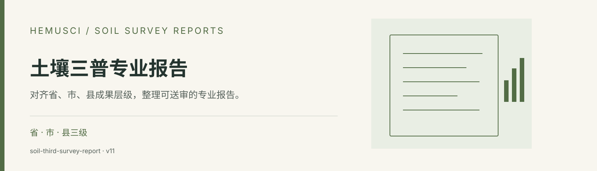

<div align="center">



# 土壤三普专业报告

**对齐省、市、县成果层级，整理可送审的专业报告。**


[](https://github.com/SoMic520/soil-third-survey-report/releases/latest)

[功能介绍](#能帮你做什么) · [安装步骤](#安装步骤) · [使用示例](#使用示例) · [技能规则](skills/soil-third-survey-report/SKILL.md) · [下载发布包](https://github.com/SoMic520/soil-third-survey-report/releases/latest)

</div>

## 这是什么

面向第三次全国土壤普查省、市、县级成果编制，结合成果层级、调查数据、土壤学术语与当地验收要求，组织报告写作、审查和文件交付。

这是给 AI 助手使用的 **Agent Skill（技能包）**，其中包含任务规则、参考资料和辅助脚本。安装到支持技能的工具后，可以在对话中用下面的示例调用。完成任务仍需工具可用的模型及运行环境。

## 能帮你做什么

| 任务 | 具体能力 |
| --- | --- |
| **识别成果层级** | 区分县级直接成果、市级县际综合和省级跨市汇总，按对应空间尺度组织写法。 |
| **覆盖专业报告** | 支持总体、工作、数据、土壤类型与属性、退化障碍、耕地质量、农业利用适宜性及成果应用等报告。 |
| **逐段核查内容** | 审查术语、数量关系、单位、精度、时空基准、证据强度、因果边界和图表说明。 |
| **修订与送审交付** | 以原始底稿为基础保留 DOCX 真实修订和批注，并核对标题、长段落、目录、版式与验收导引。 |

## 开始前准备什么

- 成果层级、行政区及报告类型
- 原始底稿、调查与检测数据、图表
- 当地验收导引、官方模板和保留要求

按任务范围，通常可以获得：

- 撰写、重构或审查后的专业报告
- 保留真实修订与批注的 DOCX
- 问题清单及跨软件版式复核记录

## 安装步骤

### 1. 准备工具

先准备 **Codex、Claude Code 或其他支持 Agent Skills 的 AI 工具**，以及 [GitHub CLI](https://cli.github.com/)。GitHub CLI 需支持 `gh skill` 命令（2.90.0 及以上；建议使用当前稳定版）。它用于下载技能。

- **Windows**：在 PowerShell 执行 `winget install --id GitHub.cli --exact`。
- **macOS**：从 [GitHub CLI 官方下载页](https://cli.github.com/) 获取安装包；已有 Homebrew 时可执行 `brew install gh`。

安装后，打开终端或 PowerShell 检查版本并登录：

```shell
gh --version
gh auth login
```

### 2. 安装到你使用的 AI 工具

以 **Codex** 为例，复制下面这一行到终端或 PowerShell 执行：

```shell
gh skill install SoMic520/soil-third-survey-report soil-third-survey-report --agent codex --scope user
```

`--scope user` 表示安装到当前用户，供不同项目使用。使用其他工具时，选择对应命令：

| AI 工具 | 安装命令 |
| --- | --- |
| Codex | `gh skill install SoMic520/soil-third-survey-report soil-third-survey-report --agent codex --scope user` |
| Claude Code | `gh skill install SoMic520/soil-third-survey-report soil-third-survey-report --agent claude-code --scope user` |
| GitHub Copilot | `gh skill install SoMic520/soil-third-survey-report soil-third-survey-report --agent github-copilot --scope user` |
| Gemini CLI | `gh skill install SoMic520/soil-third-survey-report soil-third-survey-report --agent gemini-cli --scope user` |
| Cursor | `gh skill install SoMic520/soil-third-survey-report soil-third-survey-report --agent cursor --scope user` |
| OpenCode | `gh skill install SoMic520/soil-third-survey-report soil-third-survey-report --agent opencode --scope user` |

安装前想先看看规则，可以执行：

```shell
gh skill preview SoMic520/soil-third-survey-report soil-third-survey-report
```

### 3. 在对话中使用

安装完成后，重新打开 AI 工具或开始新会话，提供你的材料，并明确写出 **“请使用 soil-third-survey-report……”**。从下面选一条示例，替换成你的实际任务即可。

## 使用示例

```text
请使用 soil-third-survey-report 审查这份县级土壤三普总体报告。先识别成果层级与当地验收要求，再逐段核查术语、数量关系和图表说明。
```

```text
请使用 soil-third-survey-report 根据各县资料组织市级土壤属性报告，核对县际可比性、空间接边和全市综合，保留数据来源与证据边界。
```

```text
请使用 soil-third-survey-report 修订这份 DOCX。以我提供的原始底稿为基础，保留真实修订记录与批注，完成目录和逐页版式复核。
```

## 使用范围

报告写法需匹配实际成果层级与当地验收要求。用户原始调查、检测和空间数据是编制依据；正式送审前需要项目负责人复核。

## 下载与更新

- [最新发布包](https://github.com/SoMic520/soil-third-survey-report/releases/latest)：适合下载、留存或按平台说明手动安装。
- [当前技能 ZIP](dist/._soil-third-survey-report-skill-20260817-v11.zip) 与 [SHA-256 校验值](dist/SHA256SUMS.txt)：用于核对文件完整性。
- 更新已安装的技能：

```shell
gh skill update soil-third-survey-report
```

AI 工具与 GitHub CLI 会持续更新；命令差异请以当前工具帮助为准。`gh skill` 的安装与预览说明见 [GitHub CLI 官方文档](https://cli.github.com/manual/gh_skill)。

## 仓库结构

```text
skills/soil-third-survey-report/
  SKILL.md       技能入口与工作规则
  agents/        智能体配置
  references/    参考资料与任务规范
  scripts/       辅助脚本与校验工具
docs/banner.svg  仓库封面
dist/            技能发布包与 SHA-256 校验值
```

[阅读完整技能规则](skills/soil-third-survey-report/SKILL.md) · [查看专项参考资料](skills/soil-third-survey-report/references/province-city-county-levels.md) · [查看拆分记录](CHANGELOG.md)

## 其他 Hemusci 技能

| 独立仓库 | 用途 |
| --- | --- |
| [土壤科学与自然科学写作](https://github.com/SoMic520/soil-all-writing) | 从原始底稿到正式交付，让文字与证据对齐。 |
| [R 土壤学科研绘图](https://github.com/SoMic520/r-soil-scientific-figures) | 按研究问题选图，把数据、代码与图形一起交付。 |
| [土壤学期刊投稿格式审查](https://github.com/SoMic520/soil-journal-format-review) | 依照期刊官方规则，逐项检查投稿文件。 |
| [土壤试验方法顾问](https://github.com/SoMic520/soil-methods-consultant) | 从测量对象出发，找到有出处的实验方法。 |

[返回 Hemusci 技能总目录](https://github.com/SoMic520/Hemusci-Skills) · [Hemusci 网站](https://hemusci.com/skills/)

---

此仓库于 2026-10-02 从 [Hemusci-Skills](https://github.com/SoMic520/Hemusci-Skills/tree/c41529fe9fe6833ff65679133dfed24ea4d4b61c/skills/soil-third-survey-report) 拆分，保留该技能的提交历史、规则与资料。原集合继续保留兼容安装入口。

**使用与许可**：沿用原仓库的许可状态，目前未设置开源许可证；公开可见不等同于授予再发布许可。参考资料、标准及第三方内容的权利归其各自权利人。有关复制、修改、传播或再发布的授权，请联系仓库所有者。
